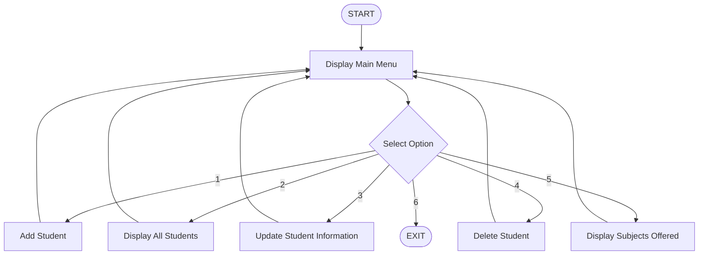
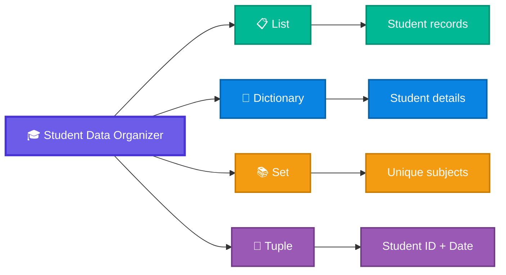

                                                      🎓 Student Data Organizer

<p align="center">
  <strong>A beginner-friendly Python command-line application for managing student records and practicing core Python collection concepts.</strong>
</p>

📖 About the Project

**Student Data Organizer** is a Python-based command-line application designed to manage student records using Python's built-in collection data structures.

The application provides a simple interactive menu for adding, displaying, updating, and deleting student information. It also maintains a collection of unique subjects using a `set`.

The main purpose of this project is to understand how **Lists, Dictionaries, Sets, Tuples, loops, conditional statements, string manipulation, type casting, and CRUD operations** can work together in a practical application.

> 
---

🎯 Project Objectives

| Objective | What the project demonstrates |
|:---|:---|
| 📋 Manage records | Add, display, update, and delete student data |
| 🧩 Use collections | Practical use of List, Dictionary, Set, and Tuple |
| 🔄 Implement CRUD | Basic Create, Read, Update, and Delete operations |
| ✂️ Process text | Handle comma-separated subjects with `split()` and `strip()` |
| 🔢 Handle input | Convert numerical input using type casting |
| 🔁 Control program flow | Use `while`, `for`, `if`, and `elif` |
| 💻 Build a CLI | Create an interactive terminal-based application |


# ✨ Features

| Feature | Description | Main Concepts |
|:---|:---|:---|
| ➕ **Add Student** | Adds a new student with ID, name, age, grade, DOB, and subjects | List, Dictionary, Tuple, Set |
| 📋 **Display Students** | Displays all currently stored student records | List, Dictionary, `join()` |
| ✏️ **Update Student** | Updates name, age, grade, and subjects using Student ID | Dictionary, List, Set |
| 🗑️ **Delete Student** | Removes a student record using Student ID | List, Dictionary |
| 📚 **Subjects Offered** | Displays subjects collected in the subject set | Set |
| 🚪 **Exit** | Stops the program safely | `break` |


# 🧭 Application Overview



---


---

# 🧠 Python Collection Concepts

The project uses different collection types for different purposes.



---

# 🗃️ Data Structures Used

## 📋 1. List

A list is used to store student records.

```python
students = []
```

The project uses:

```python
students.append(student_data)
```

to add records and:

```python
del students[i]
```

to remove a record from the list.

| Property | Details |
|:---|:---|
| Type | Ordered collection |
| Mutable | Yes |
| Used for | Student records |
| Operations | `append()`, `del` |

---

## 📖 2. Dictionary

A dictionary is used to store student information using key-value pairs.

```python
student_data = {
    student: {
        "info": student_info,
        "name": Name,
        "Age": Age,
        "Grade": Grade,
        "Date": Date,
        "Subjects": Subjects
    }
}
```

| Key | Value |
|:---|:---|
| Student ID | Student information |
| `info` | Tuple containing ID and Date |
| `name` | Student name |
| `Age` | Student age |
| `Grade` | Student grade |
| `Date` | Date of birth |
| `Subjects` | List of subjects |

---

## 📚 3. Set

A set is used to maintain unique subjects.

```python
subject_set = set()
```

Subjects are added with:

```python
subject_set.update(Subjects)
```

A set automatically prevents duplicate values.

| Property | Details |
|:---|:---|
| Type | Unordered collection |
| Duplicate values | Not allowed |
| Used for | Unique subjects |
| Operation | `update()` |

---

## 🔗 4. Tuple

A tuple is used to store the Student ID and Date of Birth together.

```python
student_info = (student, Date)
```

| Property | Details |
|:---|:---|
| Type | Ordered collection |
| Mutable | No |
| Used for | Student ID + DOB |
| Main characteristic | Immutable |

---

# 🔄 CRUD Operations

CRUD stands for **Create, Read, Update, and Delete**.

| CRUD Operation | Application Feature | What Happens |
|:---:|:---|:---|
| 🟢 **Create** | Add Student | Creates a new student record |
| 🔵 **Read** | Display Students | Reads and displays stored records |
| 🟡 **Update** | Update Student | Changes existing information |
| 🔴 **Delete** | Delete Student | Removes a student record |

---

# ✂️ String Manipulation

The application accepts subjects as comma-separated input.

### Input

```text
maths, sci, python
```

### Processing

```python
Subjects = Subjects.split(",")
Subjects = [Subject.strip() for Subject in Subjects]
```

### Result

```python
["maths", "sci", "python"]
```

| Method | Purpose |
|:---|:---|
| `split(",")` | Separates subjects at commas |
| `strip()` | Removes extra spaces |
| `join()` | Combines subjects for display |

---

# 🔢 Type Casting

The `input()` function returns user input as a string. The project converts numerical values into integers when required.

```python
student = int(input("student id: "))
Age = int(input("Age: "))
```

| Input | Conversion |
|:---|:---|
| Student ID | `str → int` |
| Age | `str → int` |

---

# 🔁 Control Flow

The application uses a `while` loop to keep the menu active.

```python
while True:
```

The selected option is handled using conditional statements:

```python
if choice == 1:
    ...
elif choice == 2:
    ...
elif choice == 3:
    ...
```

The program stops when option `6` is selected:

```python
break
```

---

# 💻 Menu

The application provides six operations:

```text
╔══════════════════════════════════════════════╗
║          STUDENT DATA ORGANIZER              ║
╠══════════════════════════════════════════════╣
║  1. Add Student                              ║
║  2. Display All Students                     ║
║  3. Update Student Information               ║
║  4. Delete Student                           ║
║  5. Display Subjects Offered                 ║
║  6. Exit                                     ║
╚══════════════════════════════════════════════╝
```

---

# 🖥️ Sample Output

### ➕ Add Student

```text
***add student***

Enter student details:
student id: 1
Name: dhara
Age: 19
Grade: A
Date of Birth (YYYY-MM-DD): 2006-02-22
Subjects (comma-separated): maths, ai, java, python

Student added Successfully
```

### 📋 Display Students

```text
Student ID: 1 | Name: dhara | Age: 19 | Grade: A
Date: 2006-02-22 | Subjects: maths,ai,java,python
```

### ✏️ Update Student

```text
***Update student information***

Enter student ID:
1

Enter your New Name: dhara
Enter your New Age: 19
Enter your New Grade: A
Enter your New Subjects:
maths, python, java

Your information updated successfully
```

### 🗑️ Delete Student

```text
***Delete Student***

Enter student ID: 1

Student deleted successfully
```

### 📚 Subjects Offered

```text
***Subjects Offered***

maths
ai
java
python
```

---

# 📁 Project Structure

```text
Student-Data-Organizer/
│
├── 📄 pr3.py
├── 📄 README.md
│
├── 📁 assets/
│   └── 🎬 demo.gif
│
└── 📁 screenshots/
    ├── menu.png
    ├── add-student.png
    ├── display-students.png
    ├── update-student.png
    ├── delete-student.png
    └── subjects.png
```

| File / Folder | Description |
|:---|:---|
| `pr3.py` | Main Python application |
| `README.md` | Project documentation |
| `assets/` | Project assets |
| `assets/demo.gif` | Optional animated demonstration |
| `screenshots/` | Application screenshots |

---

# 🧰 Tech Stack

| Technology | Purpose |
|:---|:---|
| 🐍 **Python 3.x** | Core programming language |
| 💻 **Command-Line Interface** | User interaction |
| 📋 **List** | Student record collection |
| 📖 **Dictionary** | Structured student information |
| 📚 **Set** | Unique subject tracking |
| 🔗 **Tuple** | Immutable student information |
---

# 📸 Screenshots

()

**🎥 Video:**  
(https://github.com/user-attachments/assets/4ae4bd28-0367-4576-b9e1-7b5200cd0cd6)

---

# 💾 Data Storage

The current version stores all student records **in memory** using Python data structures.

```text
Program Starts
      ↓
Student Data Stored in Memory
      ↓
User Performs Operations
      ↓
Program Exits
      ↓
Data is Cleared
```

### Current Storage

| Data | Storage |
|:---|:---|
| Student records | List + Dictionary |
| Unique subjects | Set |
| Student ID + DOB | Tuple |
| Permanent storage | ❌ Not implemented |

> **Important:** Closing the program removes the data because no file or database storage has been implemented yet.

---

# 🧠 Technical Concepts

| Concept | Used For |
|:---|:---|
| Variables | Store values during execution |
| Data Types | Represent different kinds of data |
| User Input | Collect student information |
| Type Casting | Convert input into integers |
| `if / elif / else` | Handle decisions |
| `while` loop | Keep the menu running |
| `for` loop | Iterate through student records |
| Lists | Store student records |
| Dictionaries | Organize student information |
| Sets | Track unique subjects |
| Tuples | Store immutable information |
| String Manipulation | Process subject input |
| f-Strings | Format output |
| CRUD | Manage student records |
| Collection Operations | Add, update, remove, and process data |

---

# 🎯 Learning Outcomes

By completing this project, the following concepts can be practiced:

- Understand Python's built-in collection types
- Store structured information using dictionaries
- Manage multiple records using lists
- Remove duplicate values using sets
- Understand immutable data using tuples
- Implement CRUD operations
- Work with user input
- Use loops and conditional statements
- Manipulate strings
- Build a basic interactive CLI application

---

---

# 🚀 Future Enhancements

| Planned Feature | Purpose |
|:---|:---|
| 🔐 Authentication | Add user login and access control |
| 💾 File Storage | Save student data permanently |
| 🗄️ Database | Introduce SQLite or another database |
| 🔎 Search | Find students by ID or name |
| 📊 Reports | Generate student information reports |
| 📈 Marks & Grades | Store marks and calculate results |
| 🖥️ GUI | Build a graphical interface |
| 🌐 Web Version | Convert the project into a web application |

---


👩‍💻 Author
   Dhara
 
**Built with 🐍 Python**

</p>
